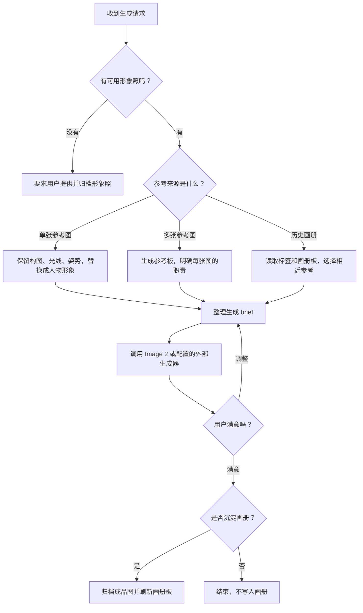

<div align="center">

# 神笔马良.skill

简体中文 | [English](./README_EN.md)

> 带着你的真人形象照，复刻参考图、沉淀个人画册，生成稳定可复用的个人视觉资产。

[](LICENSE)
[](https://agentskills.io)
[](#安装)
[](#隐私边界)

<br>

**不是泛泛复刻风格，而是先确认真人形象照，再把参考图变成你的个人视觉系统。**

神笔马良把「形象照」「参考图」「历史画册」组织成一套可复用的生图流程。它强制先确定人物来源，避免把原参考图人物、generic 人物或虚构人物混进结果里。

[看效果](#效果示例) · [安装](#安装) · [怎么用](#怎么用) · [它解决什么](#它解决什么) · [隐私边界](#隐私边界) · [更多 Skills](#更多超级峰-skills) · [作者](#作者)

</div>

---


## 效果示例

```text
用户  ❯ 使用我的默认形象照，参考这张科技封面，生成一张 B站 16:9 封面。

Agent ❯ 我会先检查 data/personas/catalog.md 和 data/personas/images，
        确认可用形象照，再把参考图拆成构图、光影、姿势和标题空间。

        本次 brief：
        - 人物来源：data/personas/images/<your-persona-file>
        - 参考来源：单张科技封面
        - 画幅：16:9
        - 替换规则：保留参考图构图，把人物替换成你的形象照
        - 负面约束：不要混脸，不要变成参考图原人物
```

```text
用户  ❯ 基于我之前满意的画册风格，生成一张雨夜街头公众号封面。

Agent ❯ 我会先刷新画册板，读取每张已沉淀图的用途、风格和场景标签，
        选择最接近「雨夜街头」「公众号封面」的 1 到 4 张作为参考。

        如果画册为空，我不会硬编风格，会请你提供参考图。
```

这不是普通的「帮我画一张图」。神笔马良的重点是：**先保护人物一致性，再复用已经验证过的视觉方向。**

## 它解决什么

很多个人 IP、独立开发者、内容创作者都会遇到一个问题：每次让 AI 生成封面、头像或海报，都像重新抽一次盲盒。

神笔马良把这个过程拆成可重复的几个环节：

- **形象照门禁**：没有真人形象照就不生成，避免人物不稳定。
- **参考图复刻**：单图保留构图和气质，多图明确每张图负责什么。
- **个人画册**：只沉淀用户确认满意的成品图，下次可以直接复用风格。
- **平台画幅路由**：内置 B站、小红书、视频号、公众号封面图等常见比例。
- **归档脚本**：把形象照、成品图、参考板和索引组织到固定目录。
- **隐私边界**：公开仓库不包含任何真人图片、画册成品或个人运行数据。

## 安装

神笔马良基于 Agent Skills 结构，可以被支持 Skills 的 Agent runtime 安装。

### 一行命令

```bash
npx skills add mileson/shenbi-maliang
```

指定安装到 Claude Code：

```bash
npx skills add mileson/shenbi-maliang --agent claude-code
```

指定安装到 Codex：

```bash
npx skills add mileson/shenbi-maliang --agent codex
```

### 手动安装

```bash
git clone https://github.com/mileson/shenbi-maliang ~/.claude/skills/shenbi-maliang
```

如果你使用的是 Codex、Cursor、OpenClaw 或其他 runtime，把仓库放到对应的 skills 目录即可。

## 怎么用

### 1. 先归档你的形象照

这个 Skill 没有「不使用真人形象照」的路径。第一次使用时，先把清晰形象照归档进去：

```bash
python3 scripts/archive_persona.py \
  --image /path/to/your-portrait.jpg \
  --id default \
  --notes "正脸清晰、日常形象" \
  --refresh
```

归档后会更新：

- `data/personas/images/`
- `data/personas/catalog.md`
- `data/personas/boards/persona_board.png`

### 2. 直接调用 Skill

```text
[$shenbi-maliang] 使用我的默认形象照，参考这张图，生成一张小红书 3:4 封面。
```

也可以基于已沉淀画册：

```text
[$shenbi-maliang] 基于已沉淀画册风格，使用我的默认形象照，生成一张雨夜赛博街头微信公众号封面图。
```

### 3. 满意后沉淀进画册

只有你明确确认满意并同意沉淀时，成品图才会进入画册：

```bash
python3 scripts/archive_image.py \
  --image /path/to/generated.png \
  --title "雨夜霓虹街拍" \
  --ratio "3:4" \
  --persona "default" \
  --content-type "生活类" \
  --purpose "生活记录" \
  --style-tags "电影感,霓虹反光,湿润街道" \
  --scene-tags "雨夜街头,城市漫步" \
  --board-label "雨夜街拍" \
  --source "外部参考图" \
  --notes "电影感、湿润街道、霓虹反光" \
  --refresh
```

## 工作流



## 仓库结构

```text
.
├── SKILL.md
├── README.md
├── README_EN.md
├── data/
│   ├── config.yaml
│   ├── memory.md
│   ├── personas/
│   │   ├── catalog.md
│   │   ├── images/
│   │   └── boards/
│   └── albums/
│       ├── catalog.md
│       ├── approved_images/
│       └── boards/
├── assets/
│   ├── readme/
│   │   └── hero.png
│   └── outputs/
└── scripts/
    ├── archive_persona.py
    ├── archive_image.py
    ├── build_reference_board.py
    └── refresh_boards.py
```

## 隐私边界

公开仓库只提供流程、脚本和空数据骨架：

- 不包含真人形象照。
- 不包含历史画册成品图。
- 不包含生成看板图。
- 不包含 API key、token、账号凭证或私人联系方式。
- 默认 `.gitignore` 会阻止后续把本地形象照、画册和输出图误提交。

如果你 fork 这个仓库自用，请确认自己的真人照片和生成图片只留在本地或私有仓库。

## 更多超级峰 Skills

如果你想看更多超级峰沉淀的实战 Skills，可以继续逛这个集合仓库：

[mileson/chaojifeng-skills](https://github.com/mileson/chaojifeng-skills)

神笔马良保持独立主仓库，方便单独安装、传播和维护；集合仓库更像一个总入口，适合继续发现其他 Skill。

## 许可证

MIT

## 作者

- SoulCard: [超级峰](https://soulcard.me/card/chaojifeng)
- X: [Mileson07](https://x.com/Mileson07)
- 小红书: [超级峰](https://www.xiaohongshu.com/user/profile/58b798d050c4b4193c8111c7)
- 抖音: [超级峰](https://www.douyin.com/user/MS4wLjABAAAA2I1fDroAQZrM8Tdz6MZfd28MCaRizKmD2-lr7UQP-a0)
- 快手: [超级峰](https://www.kuaishou.com/profile/3xeqsssav5aif84)
- 即刻: [超级峰](https://web.okjike.com/u/E769500F-3283-4BAE-B2F3-D1F0E944CB70)

---

_如果你想把自己的视觉风格从一次性生成变成长期资产，神笔马良就是这个起点。_
