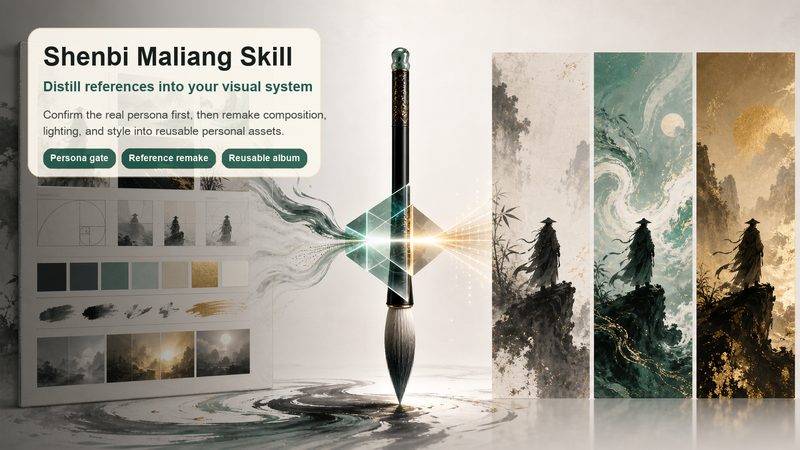
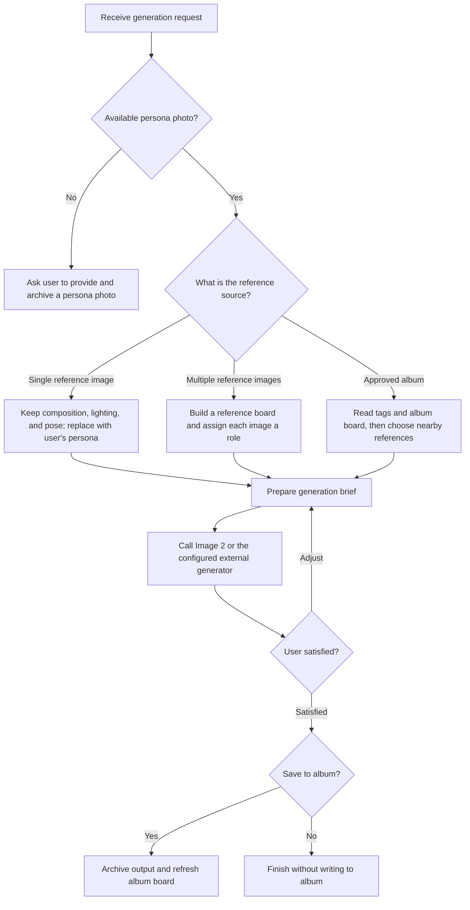

<div align="center">

# Shenbi Maliang.skill

[简体中文](./README.md) | English

> Bring your real persona photo, remake reference images, and build a reusable personal visual album.

[](LICENSE)
[](https://agentskills.io)
[](#installation)
[](#privacy-boundary)

<br>

**This is not generic style copying. It first confirms the real persona, then turns references into your personal visual system.**

Shenbi Maliang organizes a real persona photo, reference images, and approved album outputs into a repeatable image-generation workflow. It forces the agent to confirm the person source first, so the result does not accidentally borrow the original reference person, a generic character, or an invented face.

[Effect](#effect-example) · [Installation](#installation) · [Usage](#usage) · [Why](#why-it-exists) · [Privacy](#privacy-boundary) · [More Skills](#more-chaojifeng-skills) · [Author](#author)

</div>

---



## Effect Example

```text
User  ❯ Use my default persona photo, reference this tech cover, and create a 16:9 Bilibili cover.

Agent ❯ I will first check data/personas/catalog.md and data/personas/images
        to confirm an available persona photo, then break the reference into
        composition, lighting, pose, and title-space decisions.

        Brief for this run:
        - Persona source: data/personas/images/<your-persona-file>
        - Reference source: one tech cover
        - Aspect ratio: 16:9
        - Replacement rule: keep the reference composition, replace the person with your persona
        - Negative constraints: do not blend faces, do not become the original reference person
```

```text
User  ❯ Based on my previously approved album style, create a rainy-night street WeChat article cover.

Agent ❯ I will refresh the album board, read each approved image's purpose,
        style, and scene tags, then select 1 to 4 closest references for
        "rainy-night street" and "WeChat article cover".

        If the album is empty, I will not invent a style. I will ask you for a reference image.
```

This is not a simple "draw me a picture" workflow. Shenbi Maliang focuses on one thing first: **protect persona consistency, then reuse visual directions that have already been approved.**

## Why It Exists

Personal brands, indie makers, and content creators often run into the same problem: every AI-generated cover, avatar, or poster feels like a new lottery draw.

Shenbi Maliang turns that process into repeatable steps:

- **Persona gate**: no real persona photo, no generation.
- **Reference remake**: one image preserves composition and atmosphere; multiple images get explicit roles.
- **Personal album**: only user-approved outputs are saved for future reuse.
- **Platform aspect routing**: built-in presets for Bilibili, Rednote, WeChat article covers, short-video covers, and more.
- **Archive scripts**: organize persona photos, approved outputs, reference boards, and catalogs in stable folders.
- **Privacy boundary**: the public repository contains no real portraits, generated album images, or personal runtime data.

## Installation

Shenbi Maliang follows the Agent Skills structure and can be installed by runtimes that support Skills.

### One Command

```bash
npx skills add mileson/shenbi-maliang
```

Install for Claude Code:

```bash
npx skills add mileson/shenbi-maliang --agent claude-code
```

Install for Codex:

```bash
npx skills add mileson/shenbi-maliang --agent codex
```

### Manual Installation

```bash
git clone https://github.com/mileson/shenbi-maliang ~/.claude/skills/shenbi-maliang
```

If you use Codex, Cursor, OpenClaw, or another runtime, place the repository in that runtime's skills directory.

## Usage

### 1. Archive Your Persona Photo First

This Skill has no "skip the real persona photo" path. Before first use, archive a clear persona photo:

```bash
python3 scripts/archive_persona.py \
  --image /path/to/your-portrait.jpg \
  --id default \
  --notes "clear frontal portrait, everyday look" \
  --refresh
```

This updates:

- `data/personas/images/`
- `data/personas/catalog.md`
- `data/personas/boards/persona_board.png`

### 2. Call the Skill

```text
[$shenbi-maliang] Use my default persona photo, reference this image, and create a 3:4 Rednote cover.
```

You can also use an approved album style:

```text
[$shenbi-maliang] Based on my approved album style, use my default persona photo and create a rainy cyberpunk street WeChat article cover.
```

### 3. Save Approved Outputs Into the Album

An output enters the album only after you explicitly confirm that you like it and want to save it:

```bash
python3 scripts/archive_image.py \
  --image /path/to/generated.png \
  --title "Rainy Neon Street Portrait" \
  --ratio "3:4" \
  --persona "default" \
  --content-type "lifestyle" \
  --purpose "personal visual asset" \
  --style-tags "cinematic,neon reflection,wet street" \
  --scene-tags "rainy night street,city walk" \
  --board-label "rainy street" \
  --source "external reference image" \
  --notes "cinematic lighting, wet street, neon reflection" \
  --refresh
```

## Workflow



## Repository Structure

```text
.
├── SKILL.md
├── README.md
├── README_EN.md
├── data/
│   ├── config.yaml
│   ├── memory.md
│   ├── personas/
│   │   ├── catalog.md
│   │   ├── images/
│   │   └── boards/
│   └── albums/
│       ├── catalog.md
│       ├── approved_images/
│       └── boards/
├── assets/
│   ├── readme/
│   │   ├── hero-zh.png
│   │   └── hero-en.png
│   └── outputs/
└── scripts/
    ├── archive_persona.py
    ├── archive_image.py
    ├── build_reference_board.py
    └── refresh_boards.py
```

## Privacy Boundary

The public repository contains only the workflow, scripts, and empty data skeleton:

- No real persona photos.
- No approved album outputs.
- No generated boards.
- No API keys, tokens, account credentials, or private contact details.
- The default `.gitignore` prevents local portraits, albums, and outputs from being accidentally committed later.

If you fork this repository for personal use, keep your real portraits and generated images local or in a private repository.

## More Chaojifeng Skills

To explore more practical Skills maintained by Chaojifeng, visit:

[mileson/chaojifeng-skills](https://github.com/mileson/chaojifeng-skills)

Shenbi Maliang stays as an independent main repository so it can be installed, shared, and maintained on its own. The collection repository works better as a broader discovery entry.

## License

MIT

## Author

- SoulCard: [超级峰](https://soulcard.me/card/chaojifeng)
- X: [Mileson07](https://x.com/Mileson07)
- rednote: [超级峰](https://www.xiaohongshu.com/user/profile/58b798d050c4b4193c8111c7)
- Douyin: [超级峰](https://www.douyin.com/user/MS4wLjABAAAA2I1fDroAQZrM8Tdz6MZfd28MCaRizKmD2-lr7UQP-a0)
- Kuaishou: [超级峰](https://www.kuaishou.com/profile/3xeqsssav5aif84)
- Jike: [超级峰](https://web.okjike.com/u/E769500F-3283-4BAE-B2F3-D1F0E944CB70)

---

_If you want to turn your visual style from one-off generations into a long-term asset, Shenbi Maliang is the starting point._
